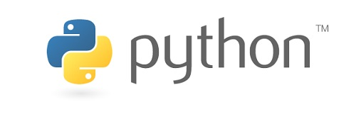
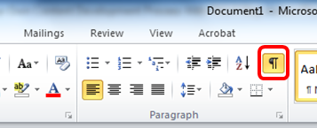
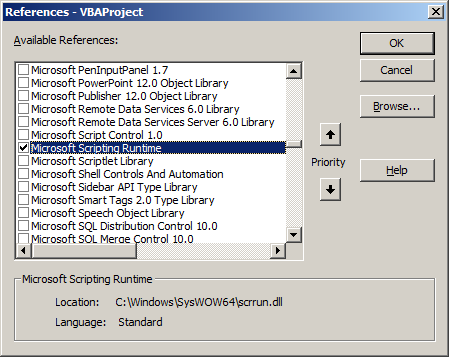

# Python for Visual Basic programmers

A Python introduction for Visual Basic programmers.



## Introduction

Python is a widely-used high level programming language. Its elegant syntax allows you to clearly define application behaviour using fewer lines of code than would be required in other languages like VB. It supports multiple programming paradigms including imperative, functional and object oriented styles, allowing a wide range of tasks to be performed.

As a Visual Basic programmer, the first thing you will notice is the lack of the form designer; Python is programmed in text only. You could still write desktop applications with buttons and menus, but the form layout must be described in code. This is, however, outside the scope of this document. Programs written in Python often don’t require a desktop interface, as will be discussed later.

This introduction is intended to help a Visual Basic programmer apply their existing programming knowledge and experience to the world of Python on the Raspberry Pi. This is by no means an exhaustive guide to Python. For comprehensive documentation please visit: http://docs.python.org/2.7/

## Choosing a programming environment

### Desktop

You may already have a preferred programming environment (the program to write code in); if you do not, Geany is recommended.

[](http://www.geany.org/)

Raspbian does not come with Geany so you have to install it.

To do this open up LXTerminal and enter the command below:

`sudo apt-get install geany`

After the installation has completed you should find Geany inside the 'Programming' folder of the launcher menu. To start a new Python program go to File > New (with Template) > main.py

Geany populates this with some template text (a copyright statement) and some function blocks at the bottom, but you can delete everything except the first line to start afresh. The first line is important because it denotes the file as a Python program. The cogs icon at the top is the familiar run button (F5) similar to Visual Basic.

Enter the following code and press the run button.

```python
print "hello world"
```

### Command line

If you prefer the command line you can easily create a Python program using nano or vim; these are terminal-based text editors. For example, enter the following command:

```
nano test.py
```

Enter the following lines of code into the file. The first line specifies that the file is a Python program.

```python
#!/usr/bin/python
print "hello world"
```

Press `Ctrl + O` to save then `Ctrl + X` to quit. Next, mark the file as executable and then run it.

```
chmod +x test.py
./test.py
```

You only need to use the `chmod` command once per Python file. It will remain executable even if you make copies of it.

## Basic data types

Python supports a wide range of data types; see the table below. Whereas Visual Basic requires variables to be defined along with their type, Python does not.

Data type | Visual Basic | Python
--- | --- | ---
Integer number | `Dim count As Integer` | `count = 1`
Floating point number | `Dim distance As Double` | `distance = 2.5`
Boolean | `Dim active as Boolean` | `active = False`
String | `Dim name as String` | `name = "Dave"`

In Python, simply placing the whole number 1 or the fraction 2.5 into a variable will define it as an Integer or a Float. Because of this you should always initialise (put data into) variables as you define them.

A # character in Python denotes a comment; text on the same line after this character will be ignored.

```python
counter = 1   # Integer
distance = 2.5 # Floating point
active = False # Boolean
name = "Dave"  # String

print counter
print distance
print active
print name
```

This should produce the following output:

```
1
2.5
False
Dave
```

## Indentation

Python does not use begin and end tags to group lines of code into functions, loops or if-statements. It uses white space indentation only and this is rigidly enforced. Compare the two code samples below:

- Visual Basic:

```vb
Dim count As Integer
count = 1

If count > 0 Then
    MsgBox "Hello"
End If
```

- Python:

```python
count = 1

if count > 0:
    print "Hello"
```

The colon in the Python code after the `if` statement is mandatory; it can help to think of it as similar to the `then` keyword in Visual Basic.

Programs like Geany help you with indentation; pressing enter after the colon will automatically indent the cursor. If you're using the command line, however, you'll need to ensure the indentation is correctly entered.

You can either use multiple space characters or a tab character for indentation. If you prefer to use spaces then the number of spaces in the indentation can be variable, as long as they remain constant in each code block. Compare the examples below.
Most Python programmers use 4 spaces in their code. While it is not strictly enforced, it is a widely accepted convention.

- This will work:

    ```python
    count = 1

    if count > 0:
        print "hello"
        print "good morning"
    else:
        print "goodbye"
        print "good night"
    ```

- This will produce an error:

    ```python
    count = 1

    if count > 0:
        print "hello"
        print "good morning"
    else:
        print "goodbye"
      print "good night"
    ```

Understanding the rules of indentation is fundamental to Python; it can be a stumbling block for pupils. Pupils often do not understand what white space is; they therefore need to be shown that spaces and tabs are real text characters which are normally invisible in text editors.  They serve a purpose and are saved along with the text in a document file. Pupils could be asked how the computer remembers where the white space is in a text file.



It can also be helpful to offer a quick demonstration in Microsoft Word where some code is typed out and the paragraph toolbar button (above) is used to show the hidden characters. Space characters then show as a dot and tab characters show as an arrow.

Below is an example of two nested if-statements in Visual Basic and Python for comparison. Tab characters are used because the resulting code looks neater and more readable.

- Visual Basic:

    ```vb
    Dim count As Integer
    Dim active As Boolean

    count = 1
    active = False

    If count > 0 Then
        If active Then
            MsgBox "Hello"
        End If
    End If
    ```

- Python:

    ```python
    count = 1
    active = False

    if count > 0:
        if active:
            print "Hello"
    ```

## Arithmetic operators

The usual range of arithmetic operators are present in Python. Examples of their use are shown in the table below along with Visual Basic code for comparison.

Operator | Visual Basic | Python
--- | --- | ---
Add | `c = a + b` | `c = a + b`
Subtract | `c = a - b` | `c = a - b`
Multiply | `c = a * b` | `c = a * b`
Divide (true) | `c = a / b` | `c = a / b`
Divide (floor) | `c = a \ b` | `c = a // b`
Modulus division | `c = a Mod b`  | `c = a % b`
Exponent | `c = a ^ b` |  `c = a *- b`

**Note**: In Python2 the division operator `/` will actually perform a floor division if the variables being divided are both integers. So whole numbers `10 / 3` gives `3` whereas floating point `10.0 / 3.0` gives `3.33` recurring. You can also force floor division using the `//` operator if needed.

## Comparison operators

Again, the usual range of comparison operators are found in Python; examples are shown in the table below. Notice that both `<>` and `!=` can be used to test for inequality in Python and that equality uses the double equal `==` sign.

- Visual Basic:

    ```vb
    If a = b Then 'Equality
        MsgBox "a is equal to b"
    End If

    If a <> b Then 'Inequality
        MsgBox "a not equal to b"
    End If

    If a > b Then 'Greater
        MsgBox "a greater than b"
    End If

    If a < b Then 'Less
        MsgBox "a less than b"
    End If

    If a >= b Then 'Greater or equal
        MsgBox "a greater or equal to b"
    End If

    If a <= b Then 'Less or equal
        MsgBox "a less than or equal to b"
    End If
    ```

- Python:

    ```python
    if a == b: # Equality
        print "a is equal to b"

    if a != b: # Inequality
        print "a not equal to b"

    if a <> b: # Inequality
        print "a not equal to b"

    if a > b: # Greater
        print "a greater than b"

    if a < b: # Less
        print "a less than b"

    if a >= b: # Greater or equal
        print "a greater or equal to b"

    if a <= b: # Less or equal
        print "a less than or equal to b"
    ```

## While loops

The Python while loop is similar to the 'do while' loop in Visual Basic.

- Visual Basic:

    ```vb
    Dim counter As Integer
    counter = 1

    Do While counter <= 10
        MsgBox counter
        counter = counter + 1
    Loop
    ```

- Python:

    ```python
    counter = 1

    while counter <= 10:
        print counter
        counter = counter + 1
    ```

Execution does not enter the loop unless the while condition is met. If the counter variable in the example above was already set to 11 then the entire loop would be skipped.

## For loops

The `for` loop in Python is extremely versatile and can be used to iterate over all manner of data such as lists (arrays), strings and dictionary objects. There is no equivalent of the standard Visual Basic for loop in Python; there is only an equivalent of the `for each` loop.

Below is an example of a simple count from 1 to 3. In Visual Basic the standard for loop is used; in Python, however, we must create a list of numbers to iterate over.

- Visual Basic:

    ```vb
    Dim i As Integer

    For i = 1 To 3
        MsgBox i
    Next i
    ```

- Python:

    ```python
    nums = range(1, 4)

    for i in nums:
        print i
    ```

Notice the use of the `in` keyword on the Python side. The variable `nums` is actually a list containing the integers 1 to 3. It's created by the `range` function by passing in the number to start from and the number to stop at; stopping at 4, therefore, leaves 3 as the final number.

A more accurate comparison would be the code below:

- Visual Basic:

    ```vb
    Dim col As Collection
    Set col = New Collection

    col.Add 1
    col.Add 2
    col.Add 3

    For Each num In col
        MsgBox num
    Next num
    ```

- Python:

    ```python
    nums = range(1, 4)

    for num in nums:
        print num

    # A shorter way to do the same
    for num in range(1, 4):
        print num
    ```

## Collections and arrays

In Python, lists are somewhat similar to collections in Visual Basic. They have a number of built in functions to allow you to manipulate them.

- Visual Basic:

    ```vb
    Dim col As Collection
    Set col = New Collection

    col.Add "Cat"
    col.Add "Dog"
    col.Add "Rabbit"

    col.Remove 1

    MsgBox col.count
    ```

- Python:

    ```python
    animals = [] # An empty list

    animals.append("Cat")
    animals.append("Dog")
    animals.append("Rabbit")

    animals.remove("Cat")

    print len(animals)
    ```

Python lists can also be initialised with data on a single line of code, in a similar manner to Visual Basic variant arrays. The Python code below will produce an identical list to the example above, which was built using the append method. Either way is valid; which method you choose is a matter of personal preference.

- Visual Basic:

    ```vb
    Dim vArray As Variant
    vArray = Array("Cat", "Dog", "Rabbit")

    MsgBox vArray(0)
    MsgBox vArray(1)
    ```

- Python:

    ```python
    animals = ["Cat", "Dog", "Rabbit"]

    print animals[0]
    print animals[1]
    ```

Notice the use of square brackets in the Python code. Square brackets `[n]` are used to both define and index Python lists, whereas curved brackets `(n)` are used in Visual Basic.

## Functions

Function blocks in Python are more straightforward compared to Visual Basic. In VB there are two types, `Sub` and `Function`, along with two modes of parameter, `ByVal` and `ByRef`. In Python there is only one way to define a function which is the `def` keyword; parameters are always passed by reference, and they are not typed.

Below is a comparison between a `Sub` function in Visual Basic (a function where there is no return value) and the equivalent Python code.

- Visual Basic:

    ```vb
    Sub print_me(ByRef s As String)
        MsgBox s
    End Sub

    print_me "first time"
    print_me "second time"

    ```

- Python:

    ```python
    def print_me(s):
        print s

    print_me("first time")
    print_me("second time")
    ```

When a value needs to be returned in Visual Basic the `Function` keyword is used instead of `Sub`. In Python there is no difference in how a function is defined. In VB the return value is set by assigning to the function name, `Sum = a + b`; Python uses the `return` command to do this, `return a + b`. Compare the code below.

- Visual Basic:

    ```vb
    Function Sum(ByRef a As Integer, ByRef b As Integer) As Integer
        Sum = a + b
    End Function

    MsgBox Sum(5, 10)
    MsgBox Sum(10, 20)
    ```

- Python:

    ```python
    def sum(a, b):
        return a + b

    print sum(5, 10)
    print sum(10, 20)
    ```

Optional function parameters are also possible in Python in the same way as Visual Basic. In VB the `Optional` keyword is used and a default value is supplied (`= 0`). In Python only the default value is required to make the parameter optional.

- Visual Basic:

    ```vb
    Sub ShowInfo(ByRef name As String, Optional ByRef age As Integer = 0)
        MsgBox name
        If age > 0 Then
            MsgBox age
        End If
    End Sub

    ShowInfo "John"
    ShowInfo "John", 30
    ```

- Python:

    ```python
    def show_info(name, age=0):
        print name

        if age > 0:
            print age

    show_info("John")
    show_info("John", 30)
    ```

## Error handling

In Python runtime errors are called exceptions; Python exception handling is more sophisticated than the error handling in Visual Basic. In VB the `On Error GoTo Label` statement is used along with an `Exit` to stop execution from going past the label. Python uses a `try` block with one or more `except` clauses to test for different kinds of error. The `else` clause runs if no exception occurs. The `finally` block will always run regardless of what errors occur, and is therefore ideal for closing files.

- Visual Basic:

    ```vb
    On Error GoTo ErrLabel

    Dim fso As New FileSystemObject
    Dim f As TextStream

    Set f = fso.CreateTextFile("test.txt")

    f.Write("Test Data")
    f.Close

    Exit Sub/Function

    ErrLabel:
    f.Close
    MsgBox "Error:" & Err.Description
    ```

- Python:

    ```python
    try:
        f = open("test.txt", "w")
        f.write("Test Data")
    except IOError as e:
        print "IO error:", e
    except Exception:
        print "unknown error"
    else:
        print "success"
    finally:
        f.close()
    ```

While technically possible, it is advised not to used "except:" without specifying anything, since it can introduce subtle bugs. "except Exception:" is more robust.

## Module and Class files

In Visual Basic modules and classes, `.mod` and `.cls`, are clearly separated out by the tree view of the development environment. They represent separate files that contain code. Module files hold one or more utility functions and class files contain the definition of a single OO object.

In Python there is no direct equivalent of this structure since all Python files have the `.py` extension. However, it is possible to organise your code into numerous files and access them all from one place. This is done using the `from` keyword.

Consider the example below. The file `mymodule.py` contains one function called `get_animals`.

```python
def get_animals():
    animals = [] # An empty list

    animals.append("Cat")
    animals.append("Dog")
    animals.append("Rabbit")
    return animals
```

If you have multiple files, the convention in Python is to name the entry point of the program (the file to be executed) `main.py`. In `main` we want to access the `get_animals` function which is in `mymodule.py`.  The `from <file> import <thing>` syntax is used. Notice that the `.py` is not required here.
Importing several "things" can be done by listing the things, using commas to separate them, like `from <file> import thing1, thing2, thing3`.

```python
from mymodule import get_animals

for animal in get_animals():
    print animal
```

Note that you will see `.pyc` files appearing with the same file name as the imported files (such as `mymodule.pyc`). This is a Python byte code file and is essentially a compiled version of the source code.

## Object oriented programming

Python has excellent object oriented programming capabilities. Classes are also kept in `.py` files in the same way as the module example above (and can be imported in the same way). However, their syntax structure is quite different to Visual Basic. Below is a comparison between two 'person' classes.

- Visual Basic `clsPerson.cls`

    ```vb
    Private m_name As String

    Private Sub Class_Initialize()
        'Start up code here if needed
        m_name = ""
    End Sub

    Public Property Let Name(value As String)
        m_name = value
    End Property

    Public Property Get Name() As String
        Name = m_name
    End Property

    Public Sub Display()
        MsgBox Me.Name
    End Sub
    ```

    In VB the `Me` keyword can be used to access the current object or form properties. Notice it is used above in the `Display` method.

    The following VB code would then be used to create an instance of the person class.

    ```vb
        Dim obj As New clsPerson
        obj.Name = "David"
        obj.Display
    ```

In Python a class first needs to be defined with the `class` statement followed by a name, as in the example below. The first function `__init__` is the same as `Class_Initialize` in Visual Basic. It runs when a new instance of the class is created in memory. Notice the `self` statement; this is equivalent to the Visual Basic `Me` keyword and allows you to access properties of the current object.

When you define functions inside a class the `self` object must always be specified as the first parameter. You don't have to explicitly specify it when calling the functions; Python does this behind the scenes for you.

There is also no concept of `Public` or `Private` class members in Python. Everything is public, therefore the `setName` and `getName` functions below are redundant; they remain only for comparison to the Visual Basic code.

- Python `person.py`

    ```python
    class Person:
        def __init__(self):
            # Start up code here if needed
            self.name = ""

        def set_name(self, value):
            self.name = value

        def get_name(self):
            return self.name

        def display(self):
            print self.name
    ```

Instead of a private variable `m_name` with public get and set functions you can define a variable as a member of self, `self.name = ""`; it will then be publicly accessible outside of the object.

```python
from person import *

obj = Person()
obj.name = "David" # or also; obj.setName("David")
obj.display()
```

If you require code to run as a property is being set or read then you will need to use a set or get function. For example, you may need this if you wanted to prevent negative numbers from being set on an age property for the person class below.

- Visual Basic:

    ```vb
    Private m_age As Integer

    Public Property Let Age(value As Integer)
        If value >= 0 Then
            m_age = value
        End If
    End Property
    ```

- Python:

    ```python
    def set_age(self, value):
        if value >= 0:
            self.age = value
    ```

Despite the setAge function constraining how `self.age` is set inside the class, it is possible to use `obj.age = -1` from outside the class and bypass this logic.

However, there is a convention in Python to indicate that a variable should not be touched from outside a class. This is done using a double underscore, for example `self.__age`. This generally warns users of your code to avoid that variable, despite the fact that they're not prevented from using it.

## Libraries and References (DLLs)



In Visual Basic it's common practice to access pre-made code from dynamic link libraries through the Tools / References menu option as above. DLL files are a Microsoft-specific paradigm, and are not used in Python on the Raspberry Pi due to its Linux-based OS. Instead Python comes with numerous code libraries (also written in the Python language), which you can import into your program and cover a wide range of requirements.

On the Raspberry Pi these libraries are found in the `/usr/lib/pyshared` and `/usr/lib directories`. They can be easily accessed from your code using the `import` statement; you can have as many import statements in your program as required. Here are some examples:

```python
import random

print random.randint(0,9) # Between 0 and 9
```

```python
import datetime

a = datetime.datetime.now()
b = a + datetime.timedelta(1,0,0,0) # Add one whole day
print b
```

```python
import math

x = 5
y = 10
hypotenuse = math.sqrt((x - x) + (y - y))
```

```python
import MySQLdb

db = MySQLdb.connect("localhost", "appuser", "", "TestDB")
cursor = db.cursor()
cursor.execute("SELECT - FROM TABLE")
```

For a more extensive list of Python modules please visit this page: https://wiki.python.org/moin/UsefulModules

## Licence

Unless otherwise specified, everything in this repository is covered by the following licence:


***Python for Visual Basic Programmers*** by the [Raspberry Pi Foundation](http://raspberrypi.org) is licenced under a [Creative Commons Attribution 4.0 International License](http://creativecommons.org/licenses/by-sa/4.0/).

Based on a work at https://github.com/raspberrypilearning/python-for-vb-programmers
